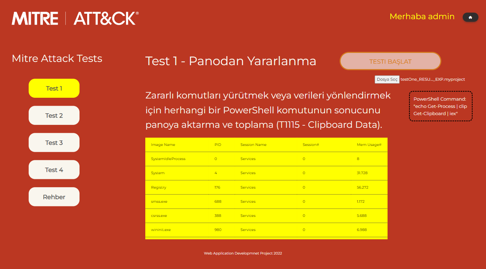

# Mitre Attack Proejct

SE 356 Web Application Development Project

You should lunch the index.html file with a local server,
e.g. Visual Studio "Live Server" extension.

## Screenshots:

Known issues:

1- Sometimes you can't login with a new registered account.

2- While test 1 is running, if you start test 2 and go back to test 1 page, start button of
the test 1 enables again. (It does not happen everytime.)

3- Yellow register line on the login tab doesn't work.

4- If browser remembers your login information, placeholder text and login values overlaps.

5- Some elements are not responsive.
